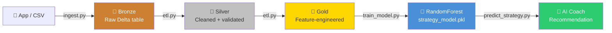

# HMA Strategy Data Lake + AI/ML

> **Data Lake + ML demo for Hunt Master Academy's Hunt Strategy Pillar — powering AI Coaching recommendations**

Raw hunt telemetry lands in a Delta Lake, flows through the **medallion architecture** (Bronze → Silver → Gold), and trains a RandomForest model that acts as a personalised AI Coach: *"For whitetail in 10 mph NW wind at dawn → 78% success with ambush strategy"*.

---

## Architecture



| Layer | Path | Description |
|-------|------|-------------|
| 🔶 Bronze | `lake/bronze/hunts` | Raw CSV ingested as-is — immutable, append-friendly |
| 🥈 Silver | `lake/silver/hunts` | Deduped, validated lat/lon & weather, typed dates |
| 🥇 Gold | `lake/gold/hunts_features` | One-hot + ordinal encoded, ML-ready |
| 🤖 Model | `models/strategy_model.pkl` | RandomForest (200 trees) + SHAP explainability |

---

## How This Powers Hunt Master Academy

Hunt Master Academy's **Q1 2026 Game Strategy launch** promises *"True AI analysis"* of hunt conditions. This data lake is the backbone:

1. **Data ingestion** — mobile app logs (quarry, GPS, weather, strategy) land in Bronze
2. **ETL pipeline** — Silver cleans sensor noise; Gold adds derived features
3. **Model training** — learns from thousands of real hunt outcomes
4. **AI Coach** — given today's wind/temp/moon, recommends the highest-probability strategy *and explains why* (via SHAP feature importance)

---

## Repository Structure

```
hma_strategy_datalake/
├── README.md
├── requirements.txt
├── docker-compose.yml          # MinIO S3-compatible object store (optional)
├── data/
│   └── raw/                    # Generated CSV (git-ignored after first run)
├── lake/                       # Generated at runtime (git-ignored)
│   ├── bronze/
│   ├── silver/
│   └── gold/
├── notebooks/
│   ├── 01_data_generation.ipynb
│   ├── 02_ingest_to_lake.ipynb
│   ├── 03_etl_medallion.ipynb
│   └── 04_ml_training.ipynb
├── src/
│   ├── generate_synthetic_data.py
│   ├── ingest.py
│   ├── etl.py
│   ├── train_model.py
│   └── predict_strategy.py     # AI Coach inference
├── models/
│   └── strategy_model.pkl      # Trained model (git-ignored)
├── tests/
│   └── test_pipeline.py        # End-to-end pytest suite
└── .github/workflows/ci.yml    # Auto-test pipeline
```

---

## Quick Start (one-click run)

### Prerequisites

```bash
python -m pip install -r requirements.txt
```

### Full pipeline

```bash
# 1. Generate 5 000 synthetic hunt logs
python -m src.generate_synthetic_data

# 2. Ingest raw CSV → Bronze Delta Lake
python -m src.ingest

# 3. ETL: Bronze → Silver → Gold
python -m src.etl

# 4. Train the AI Coach model
python -m src.train_model

# 5. Get a recommendation
python -m src.predict_strategy \
    --quarry whitetail \
    --wind_speed 5 \
    --wind_dir NW \
    --temp_c 8 \
    --duration_min 240 \
    --moon_phase waxing_crescent
```

**Example output:**

```
🤖 Hunt Master AI Coach Recommendation
=============================================
  Quarry    : whitetail
  Wind      : 5.0 kn NW
  Temp      : 8.0 °C
  Moon      : waxing_crescent
  Duration  : 240 min planned

  ✅ Best strategy : AMBUSH
  🎯 Success prob  : 43%

  Strategy breakdown:
    ambush       43%  ████████
    still_hunt   40%  ████████
    stalking     38%  ███████
    calling      37%  ███████

  Top factors driving recommendation:
    • wind_favorable (+0.024)
    • wind_speed (-0.018)
    • is_ambush (+0.011)
```

### Run tests

```bash
pytest tests/ -v
```

---

## Tech Stack

| Component | Library | Why |
|-----------|---------|-----|
| Data Lake | `deltalake` ≥ 0.15 | ACID transactions, time travel, schema enforcement — industry standard (Databricks, Netflix) |
| Processing | `polars` + `pyarrow` | Blazing fast DataFrame; zero-copy Arrow interop with Delta |
| ML | `scikit-learn` RandomForest | Robust, interpretable, no GPU needed |
| Explainability | `shap` | Shows *why* a tactic is recommended — perfect for "personalised feedback" |
| Synthetic data | `faker` | Reproducible, realistic hunt-log generation |

---

## Optional: MinIO (S3-compatible local object store)

For a production-feel data lake without AWS costs:

```bash
docker compose up -d
```

This starts a MinIO server at `http://localhost:9001` (user: `minioadmin` / `minioadmin`) and creates a `datalake` bucket. You can then point Delta Lake writes to `s3://datalake/bronze/hunts` by setting:

```python
storage_options = {
    "AWS_ENDPOINT_URL": "http://localhost:9000",
    "AWS_ACCESS_KEY_ID": "minioadmin",
    "AWS_SECRET_ACCESS_KEY": "minioadmin",
    "AWS_ALLOW_HTTP": "true",
    "AWS_S3_ALLOW_UNSAFE_RENAME": "true",
}
write_deltalake("s3://datalake/bronze/hunts", df.to_arrow(),
                storage_options=storage_options)
```

---

## Data Schema

### Bronze / Silver

| Column | Type | Description |
|--------|------|-------------|
| `hunt_id` | string | UUID session identifier |
| `date` | date | Hunt date |
| `quarry` | string | `whitetail` / `turkey` / `elk` |
| `lat`, `lon` | float | GPS coordinates (continental US) |
| `wind_speed` | float | Knots (0–25) |
| `wind_dir` | string | Compass (N, NE, E, … NW) |
| `temp_c` | float | Temperature °C (-5 to 35) |
| `moon_phase` | string | 8-phase moon cycle |
| `strategy_used` | string | `ambush` / `still_hunt` / `stalking` / `calling` |
| `duration_min` | int | Hunt duration (30–480 min) |
| `success` | int | 0 = unsuccessful, 1 = harvest |

### Gold (adds)

| Column | Type | Description |
|--------|------|-------------|
| `wind_favorable` | int8 | 1 if wind_speed < 10 kn |
| `is_ambush` … `is_calling` | int8 | Strategy one-hot |
| `is_whitetail` … `is_elk` | int8 | Quarry one-hot |
| `moon_numeric` | int8 | Ordinal moon phase (0–7) |
| `wind_dir_numeric` | int8 | Ordinal wind direction (0–7) |

---

## Future Extensions

- **Stream ingest** — Kafka + Delta streaming for real-time app telemetry
- **Cloud scale** — swap local Delta for S3 + AWS Athena (one `storage_options` dict change)
- **LLM coach** — fine-tune a small LLM on Gold data for natural-language hunt coaching
- **Dashboard** — Streamlit app reading directly from the Gold Delta table

---

## License

MIT — see [LICENSE](LICENSE)

